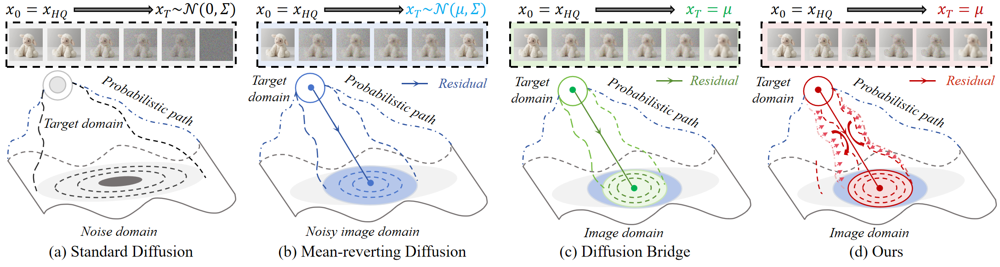
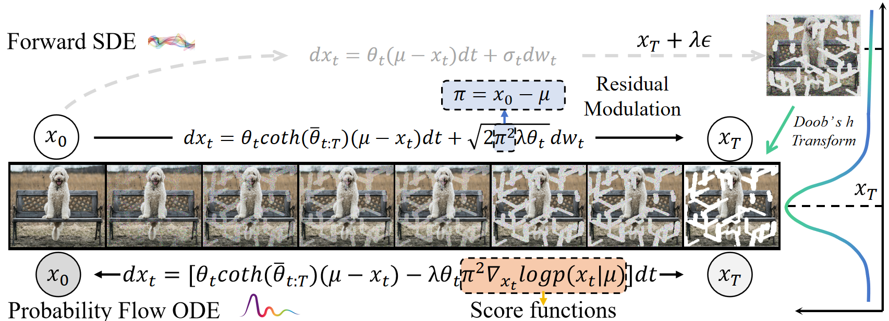
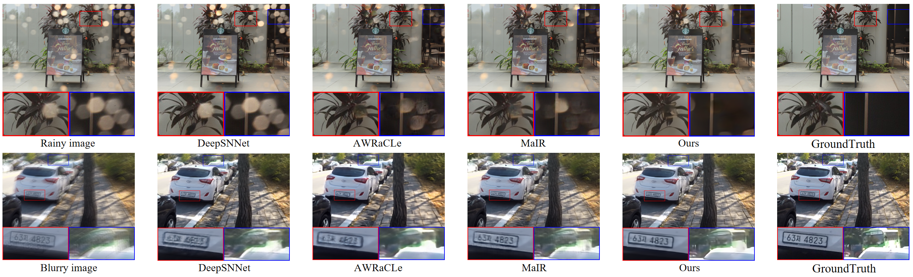
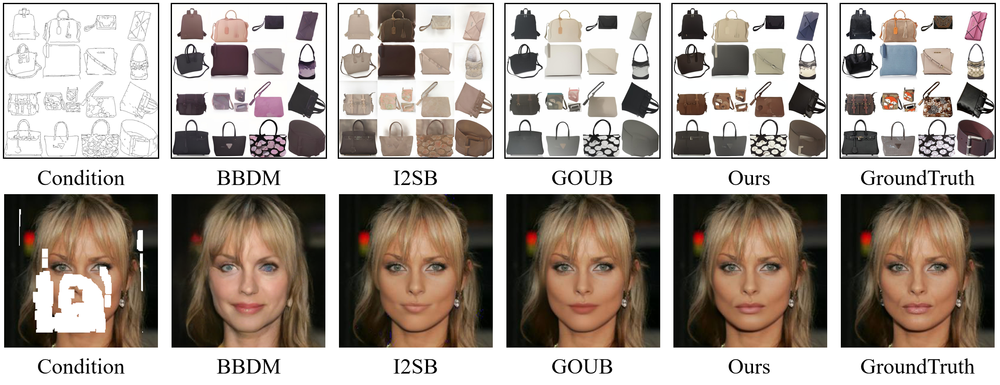

# Project

# Residual Diffusion Bridge Model for Image Restoration

<em>Hebaixu Wang, Jing Zhang, Haoyang Chen, Haonan Guo, Di Wang, Jiayi Ma and Bo Du</em>.

[Paper](https://arxiv.org/abs/2510.23116) |  [Github Code](https://github.com/MiliLab/RDBM)

## Abstract

Diffusion bridge models establish probabilistic paths between arbitrary paired distributions and exhibit great potential for universal image restoration. Most existing methods merely treat them as simple variants of stochastic interpolants, lacking a unified analytical perspective. Besides, they indiscriminately reconstruct images through global noise injection and removal, inevitably distorting undegraded regions due to imperfect reconstruction. To address these challenges, we propose the {R}esidual {D}iffusion {B}ridge {M}odel (RDBM). Specifically, we theoretically reformulate the stochastic differential equations of generalized diffusion bridge and derive the analytical formulas of its forward and reverse processes. Crucially, we leverage the residuals from given distributions to modulate the noise injection and removal, enabling adaptive restoration of degraded regions while preserving intact others. Additionally, we unravel the fundamental mathematical essence of existing bridge models, all of which are special cases of RDBM and empirically demonstrate the optimality of our proposed models. Extensive experiments are conducted to demonstrate the state-of-the-art performance of our method both qualitatively and quantitatively across diverse image restoration tasks.

## Introducation

## Overview

## Stochastic Trajectories

## Visualization

## Datasets Information

TODO

## Model Checkpoint

TODO

### Contributor

Baixuzx7 @ wanghebaixu@gmail.com

### Copyright statement

The project is signed under the MIT license, see the [LICENSE.md](https://github.com/MiliLab/RDBM/LICENSE.md)
